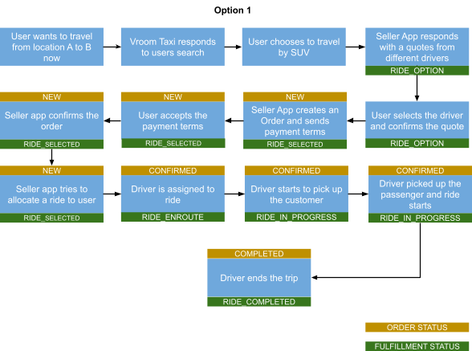
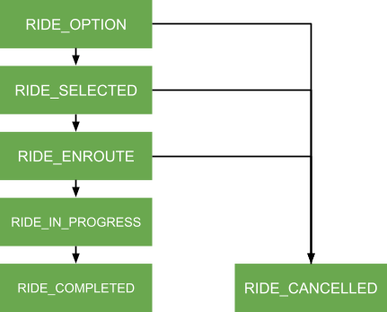

**# ONDC Mobility API Contract

## Introduction

This document defines the API schema that maps the ondemand ride hailing use case in mobility. This document is intended for developers of Seller Apps and Buyer Apps who want to expose or consume the mobility services on ONDC respectively. This document takes examples to describe the JSON payloads for each API request and responses.

## API definition

Mobility API has following APIs

* Pre-Order APIs
  * /search - Buyer App specifies the search intent.
  * /on_search - Seller App responds to search intent with a catalog
  * /select - Buyer App selects the items from the given catalog
  * /on_select - Seller App responds with quote and service details
  * /init - Buyer App accepts the quote and service details
  * /on_init - Seller App acknowledges and sends user the payment terms
  * /confirm - Buyer app accepts the payment terms and confirms to pay for the order
  * /on_confirm - Seller app confirms the order is placed
* Post-Order APIs
* /status - Buyer app requests for current status of the order
* /on_status - Seller apps responds with order with current status
* /track - Buyer app request to track a order
* /on_track - Seller app responds with the URL where tracking information can be found.
* /cancel - Buyer app requests for cancellation of the order
* /on_cancel - Seller App cancels the order on receiving the cancel request from Buyer App if order is cancellable or calls this API if its unable to fulfill the order
* /rating - Buyer app submits a rating on the order
* /on_rating - Seller apps responds to the rating received

The below diagram represents the flow between the Buyer App, Seller App and ONDC Gateway.

## API and Data Definition

Please refer [here](https://github.com/hariharanweb/ONDC-Protocol-Specs/blob/mobility-0.0.0/protocol-specifications/core/v0/api/mobility.yaml) for API definition.

Documentation on data attributes can be found [here](https://docs.google.com/spreadsheets/d/1WAAcAcVw9GCMQhLN35Y49umYmRxs4TPKEknfU6Gjo1Q/edit?usp=share_link).

## ONDC Messages

Every message in ONDC has 2 parts.

* Context

  * Defines the context for communication between Buyer and Seller App.
  * The important fields in context
    * domain - defines the mobility domain (nic:<>)
    * action - what action to be performed Eg: search, on_confirm
    * bap_id - The subscriber id of the buyer app
    * bap_uri - URI of the buyer app
    * bpp_id - The subscriber id of the seller app
    * bpp_uri - URI of the seller app
    * transaction_id - Unique id generated by buyer app on call to /search API. transaction_id will remain the same across the entire conversation between the buyer and seller.
    * message_id - A unique id which is the same across the pairs of the request and response. Eg: /search and /on_search will have the same message_id.
    * ttl - time until when the request is valid given as ISO8601 string
* Message

  * Defines the actual response of the respective API. Eg: message will have the catalog in /on_search API.

## Use Cases

We will look at a use case where a user wants to travel from location A to B. Vroom taxis respond to the user request.User chooses a SUV from the catalog of services from Vroom and takes the ride.

Option 1 - User gets to select quotes from multiple drivers

Option 2 - User gets auto assigned a ride

## Order And Fulfillment Status

#### Order States

#### Fulfillment States

**

**
